# GetBetter
 
Proyecto intermodular final, 2º CFGS ASIR, IES Albarregas.
Autor: César García Periáñez
 
La documentación completa está en `cesar_garcia_documentacion_TFG.pdf`.
 
La web está disponible en [getbetter.ddns.net](http://getbetter.ddns.net) cuando el administrador la tiene encendida.
 
---
 
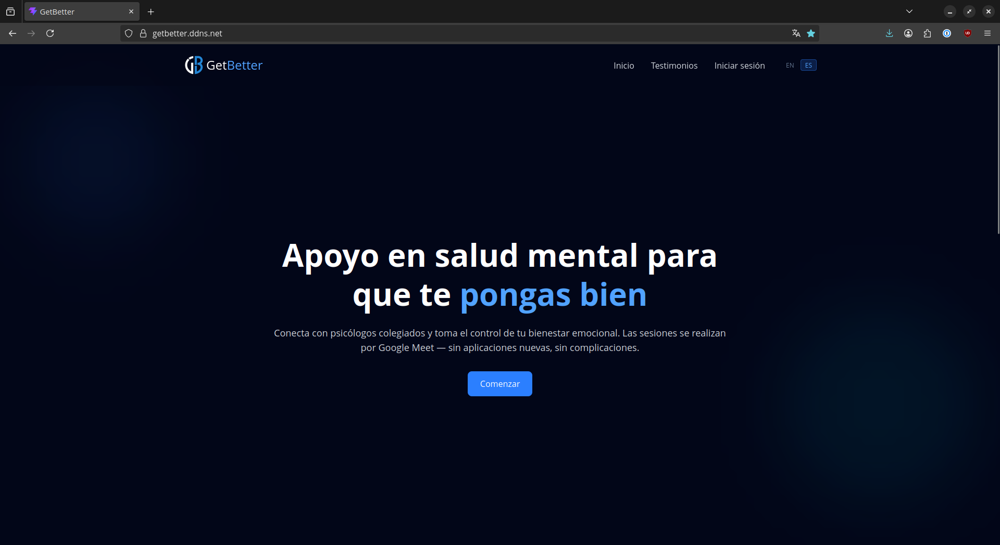
 
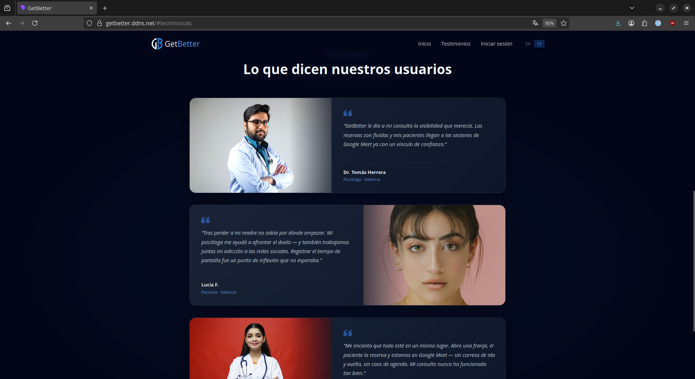
 
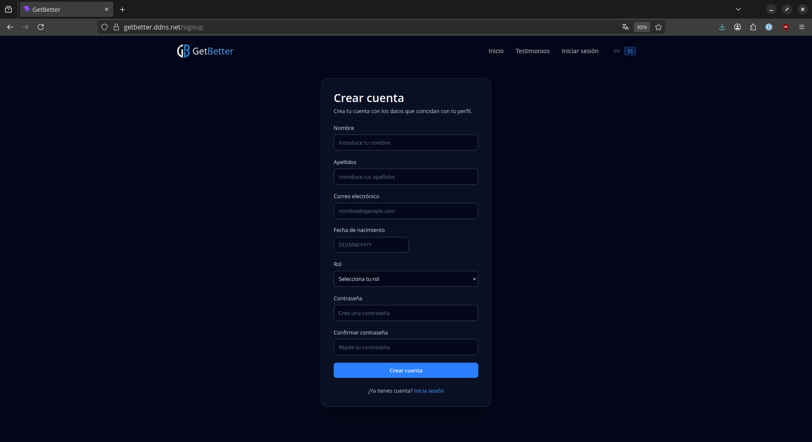
 
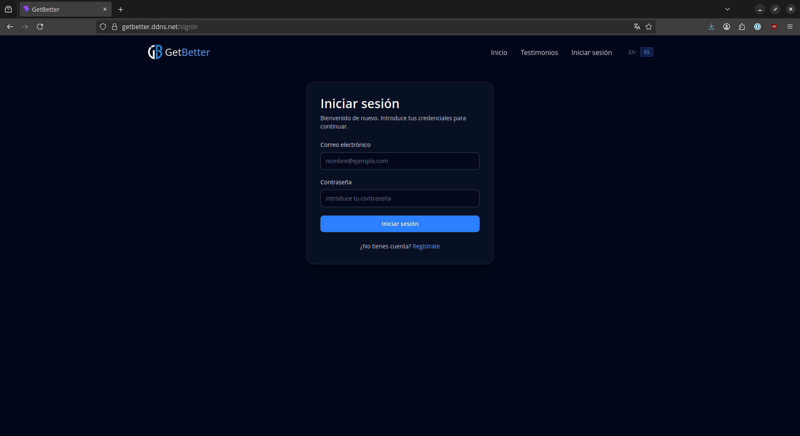
 
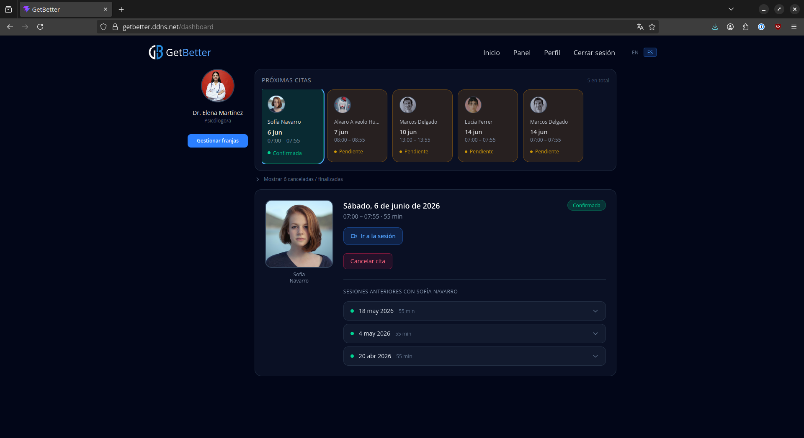
 
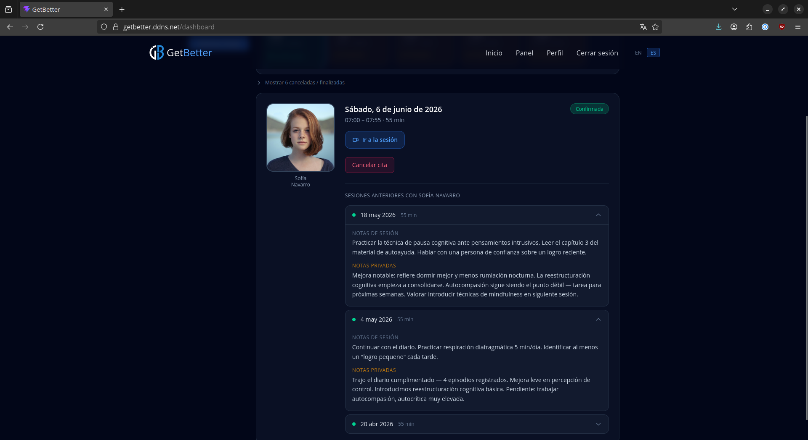
 
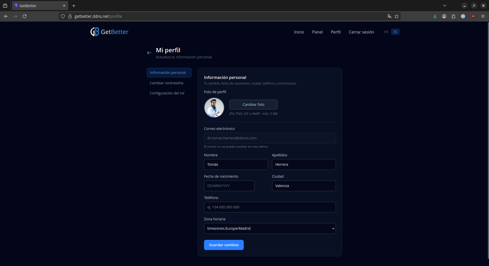
 
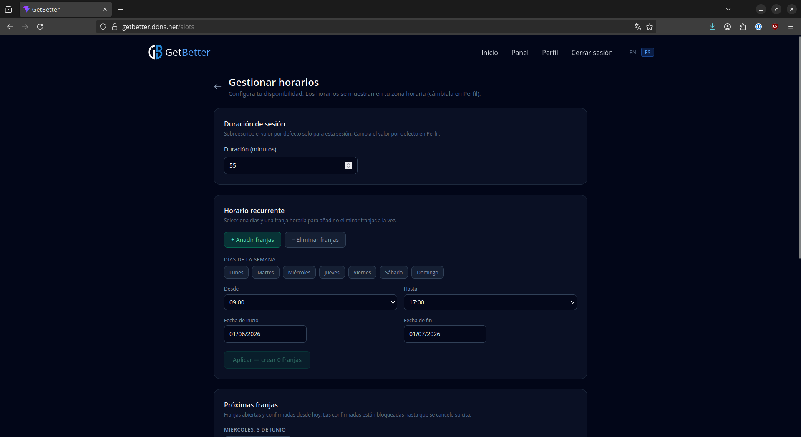
 
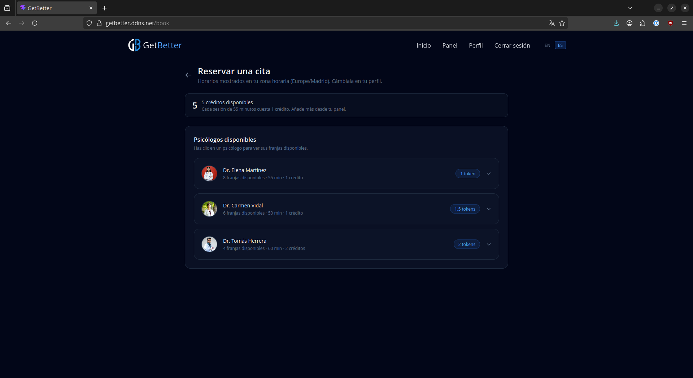
 
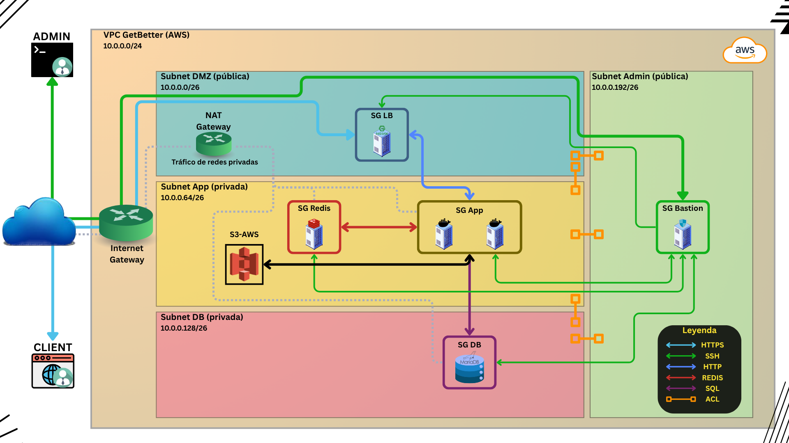
 
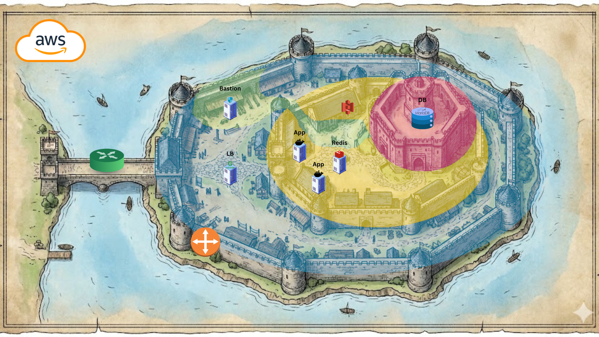
